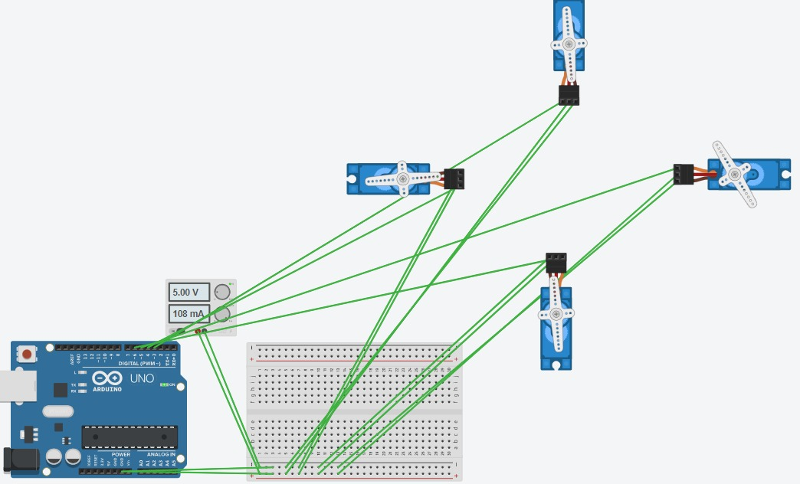

# Apresentação da Solução

## Funcionamento
Link para o video: <a href="./Midia/Funcionamento.mp4">Funcionamento.mp4</a>

## Desenvolvimento
Os estagios iniciais de desenvolvimento foram compostos por técnicas como "Brainstorming" e a criação de rascunhos sobre o design da máquina

 

Também foram feitos os primeiros testes na plataforma Tinkercad e criação de um Trello para acompanhamento das atividades

  
 

Um pouco mais para frente do projeto, começaram a ser feitos os primeiros testes com componentes físicos e também finalização do app desenvolvido

  
  

Testes com os servos de alto torque:

Teste 1: <a href="./Midia/TesteServos2.mp4">Teste1.mp4</a>

Teste 2: <a href="./Midia/TesteServos3.mp4">Teste2.mp4</a>  

Primeira Dobragem:

Dobragem: <a href="./Midia/TesteDobragem.mp4">Teste3.mp4</a>