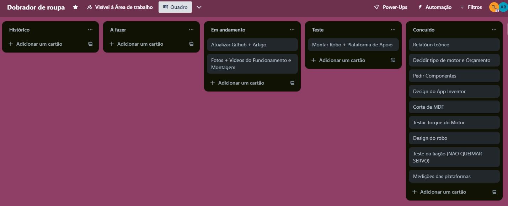

## Gerenciamento de Projeto

# Metodologia

A metodologia optada foi a da Ágil Scrum, estrutura de colaboração em equipe comumente usada no desenvolvimento de projetos. Esse sistema foi adaptado para haver um Scrum, que prescreve que as equipes dividam o trabalho em metas a serem concluídas dentro de iterações com limite de tempo, chamadas sprints e auxiliar no desenvolvimento, e os Desenvolvedores, que efetivamente fazem o projeto, porém sem um Product Manager. 

Os desenvolvedores foram divididos em duas equipes, um para desenvolvimento de código (aplicativo e Esp32) e outro para o hardware. Essa estrutura permitiu uma abordagem colaborativa e eficiente, facilitando a
integração de ambos os aspectos do projeto e promovendo um progresso contínuo e
coordenado em todas as frentes de trabalho.

### Divisão de Papéis

A equipe utiliza metodologias ágeis, tendo escolhido o Scrum como base para definição do processo de desenvolvimento. A equipe está organizada da seguinte maneira:
- Scrum Master: Joao Pedro Neffa de Sousa Oliveira;
- Equipe de Desenvolvimento: Alexandre Versiani Raposo, Eduardo de Grazia Franco, Júlia Pinto Lara Resende, Pedro Henrique Simão Diniz;

### Processo

A estrutura Scrum foi implementada de diversas formais, tais quais:

- Reuniões semanais com o objetivo de atualizar o progresso do projeto entre o grupo
- Planejamento e criação de "Sprints", ou objetivos a serem entregues até uma data específica
- Revisão e monitoramento dos "Sprints"
- Criação de um canal de mensagens para remoção de impedimentos e promoção da comunicação.
- Quadro Kanban (Trello) para acompanhamento das atividades:

 

### Ferramentas

As ferramentas utilizadas no projeto foram:

- Arduino IDE
- MIT App Inventor
- Trello
- VS Code
- FreeCAD
- Git/Github