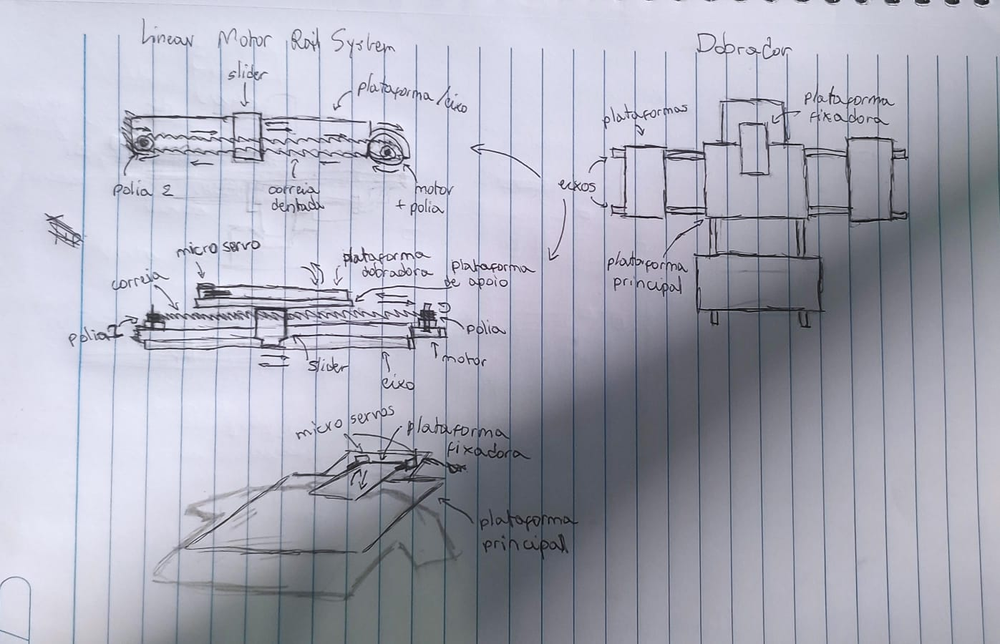
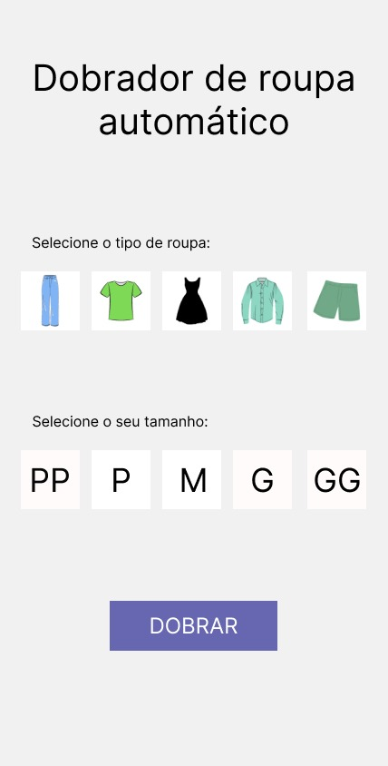
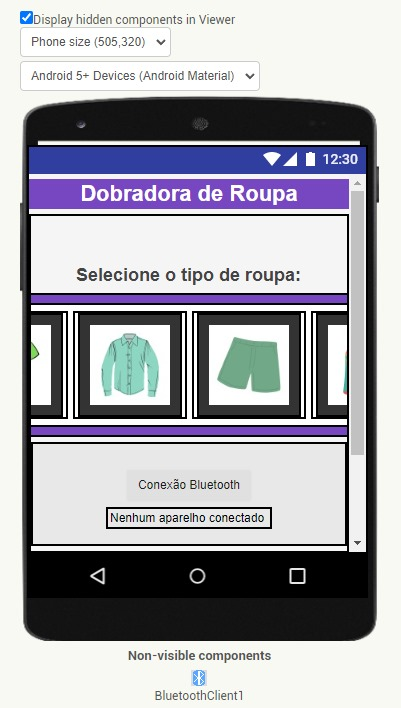
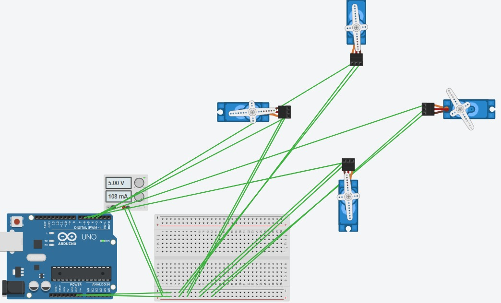
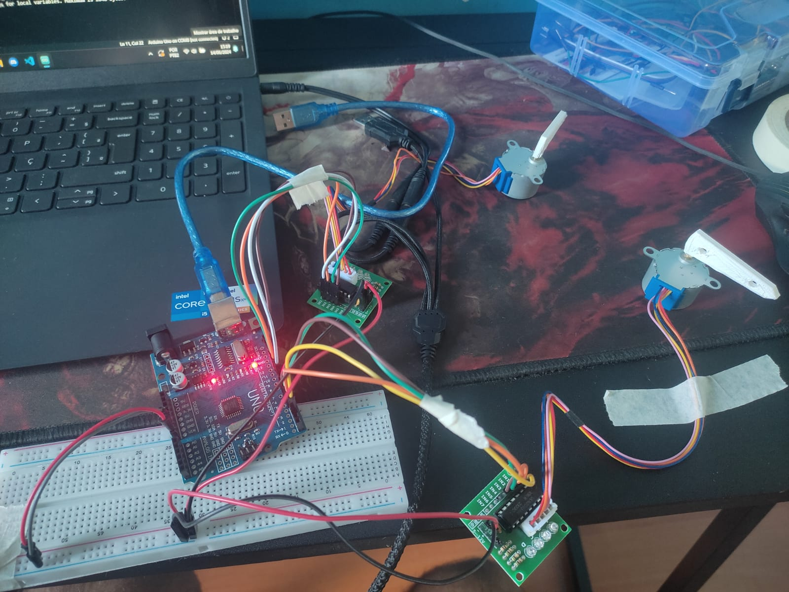
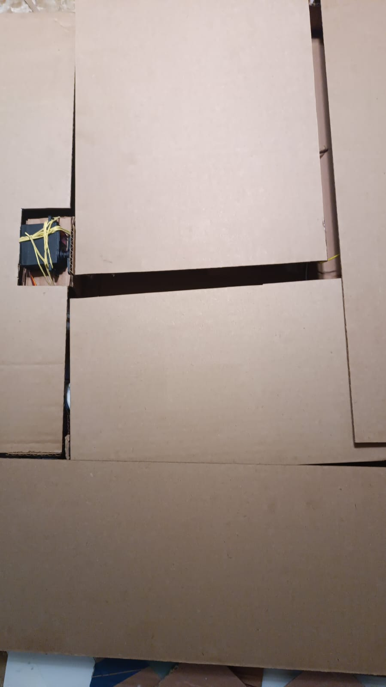

# Materiais

Os materiais utilizados no projeto foram:
- ESP32
- 4x Servos Motores MG996r
- Protoboard
- Cabos Jumpers
- Fonte 5v 5A
- Adaptador entrada P4

#### Materiais de Construção

- Papelão
- Fita
- Cola Super Bonder

# Desenvolvimento

Os estagios iniciais de desenvolvimento foram compostos por técnicas como "Brainstorming" e a criação de rascunhos sobre o design da máquina. O primeiro formato pensado foi de uma máquina com plataformas móveis para que se adaptar-se a qualquer tipo de roupa, porém ela foi logo descartada por causa da quantidade de materiais necssários e dificuldade do projeto, alterando para plataformas estáticas mas que funcionassem como o planejado anteriormente.

 

## Desenvolvimento do Aplicativo
O aplicativo começou a ser pensado e desenvolvido desde o início do projeto, começando com o visual inicial considerando as limitações e funcionalidades do App Inventor do MIT, plataforma utilizada para esse processo.

### Interface

Inicialmente, foi feito um design pelo Canvas para formulação das formulação das funcionalidades como botões, bluetooth e seleção das roupas e seu respectivo tamanho (PP, P, M, G ou GG):

 

Com algumas mudanças como a definição de quais roupas eram possíveis serem dobradas, e a não utilização de plataformas móveis para dobrar diferentes tamanhos de roupa, a interface obteve um resultado final satisfatório.

 

### Código

Como os códigos do App Inventor são inteiramente feitos em blocos, houveram algumas limitações e dificuldades nesse processo, porém conseguiu-se fazé-lo totalmente funcional.

A ideia do código é que quando o usuário aperte qualquer um dos botões de seleção de roupa, o número da variável varie de 1-3 e envie esse valor por bluetooth para o Esp32 ao apertar o botão "Dobrar", que irá interpreta-lo e realizar a dobragem.

<a href="../Apresentacao/Midia/AppInventorCodigo.jpeg">Código do aplicativo</a>

## Desenvolvimento do Hardware

### Montagem

Os primeiros testes com o hardware e código, avaliando bibliotecas e uso dos servos servos, foram feitos na plataforma Tinkercad, antes mesmo da compra dos materiais e componentes

 

Um pouco mais para frente do projeto, começaram a ser feitos os primeiros testes com componentes físicos, utilizando de motores de passo 28BYJ para controle dos movimentos, alimentados por uma fonte externa de 5V 5A que seria necessária para alimentar todos os motores.

 

Por causa da incapacidade dos motores 28BYJ de movimentarem as plataformas dado pelo baixo torque do mesmos (2,2 kgf.m), eles tiveram que ser substituídos por servos motores MG996r de alto torque (11 kgf.m) para aguentar o peso dos materiais somado as roupas.

Além disso o material pensado para a estrutura do projeto foi trocado de MDF para papelão por ser uma opção mais viável, barata e leve.

Para a finalização do projeto, foi construída toda a estrutura a base de papelão para apoio dos componentes e plataformas.

 

### Desenvolvimento do Código

O código destinado ao Esp32 foi feito na plataforma Arduino IDE, destinada ao desenvolvimento de códigos para microcontroladores.

Nos estágios iniciais do desenvolvimento, os códigos foram orientados a rotação dos motores 28BYJ-48 atrelado a módulos de controle ULN2003 utilizando de bibliotecas externas como a "CustomStepper.h", que permite uma abstração dos movimentos dos motores por meio de funções específicas.

Com a troca do motor para o servo MG996r, a biblioteca utilizada passou a ser uma interna do próprio Arduino IDE, a "ESP32Servo.h", que funciona da mesma forma que a "Servo.h", porém previne erros relacionados a diferença entre Arduino e Esp32.

<a href="../Codigo/MotorTeste.ino">Código do ESP32</a>

## Comunicação entre App e Hardware

Para comunicação entre o aplicativo e o ESP32, foi incluida a biblioteca "BluetoothSerial.h" no código do microcontrolador e usadas as ferramentas de bluetooth do App Inventor na interface e código.

Como já explicado, o aplicativo envia um numero de 1-3 como indexador do tipo de roupa para o ESP32, que recebe e aplica em seu programa. O valor desse numero estipula quais plataformas devem ser acionadas ou não para dobragem. Por exemplo, uma camisa utiliza de todas as plataformas para esse processo, enquanto uma bermuda usa apenas duas.

<a href="../Apresentacao/Midia/BluetoothCodigo.jpeg">Código do Bluetooth do aplicativo</a>