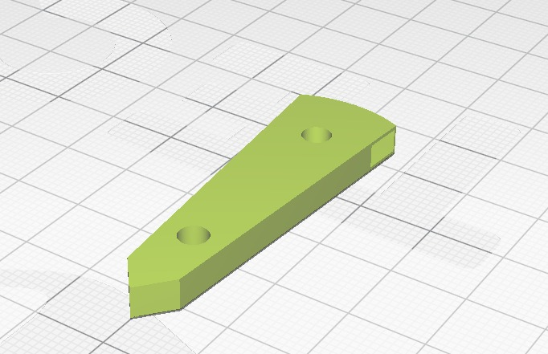
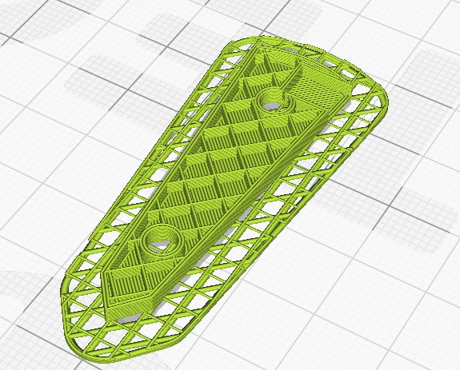
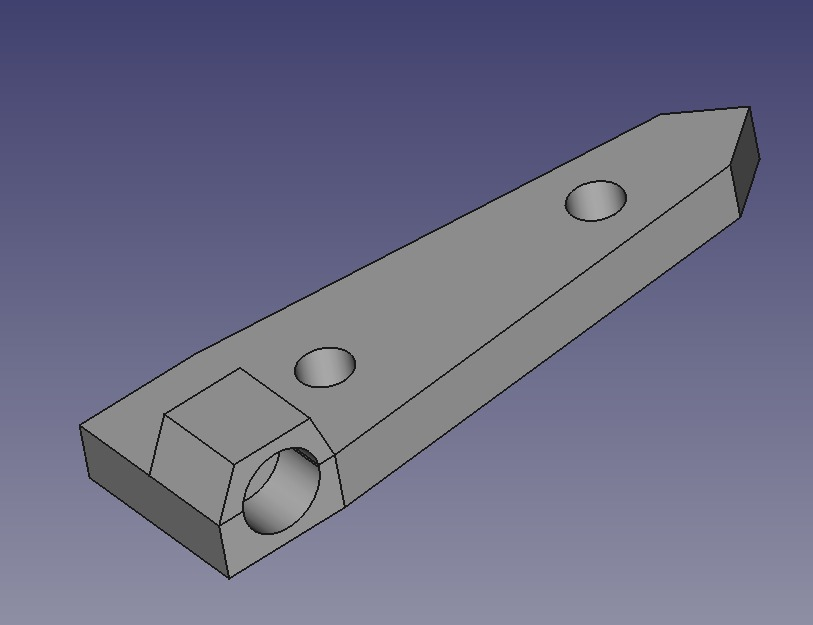

# Testes do Projeto

Os testes foram majoritariamente voltados ao desenvolvimento do hardware, já que não houveram grandes problemas com o software.

Dentre esses, os principais foram as testagens dos motores utilizados, já que surgiram problemas como a insuficiencia do torque, escolha dos componentes, e conecção com os motores.

Testes com os motores de passo 28BYJ-48 foram realizados para testar se um torque de 2,2 kgf.m seria suficiente, porém os resultados foram negativos.

O segundo teste foi com servos motores MG996r de torque 11 kgf.m, porém apresentaram resultados negativos quando colocados à baixa voltagem oferecida pelo ESP32. Desse modo foi proposta a solução de se usar uma fonte externa para alimentação, o que aumentou a velocidade e o torque dos motores quando expostos a 5V e uma amperagem total muitas vezes maior.

Testes com Motores de Passo:

  

Testes com os servos de alto torque:

Teste 1: <a href="../Apresentacao/Midia/TesteServos2.mp4">Teste1.mp4</a>

Teste 2: <a href="../Apresentacao/Midia/TesteServos3.mp4">Teste2.mp4</a>  

Primeira Dobragem:

Dobragem: <a href="../Apresentacao/Midia/TesteDobragem.mp4">Teste3.mp4</a>

Por fim, houveram testes com os braços utilizados como ponto de ligação das plataforma com o motor para distribuição do torque. Foram realizados diversos designs utilizando a plataforma FreeCad para impressão 3D, sendo os primeiros para encaixe nos motores 28BYJ

      

Os designs foram adaptados para o servo MG996r logo após, porém o formato desse não se mostrou satisfatório uma vez que eles não se encaixavam efetivamente nos motores e tiveram que ser descartados.

  

Por fim, foram utilizados os braços que vêm com o a compra dos servos, moldados com papelão, já que as outras alternativas tiveram resultados negativos.
